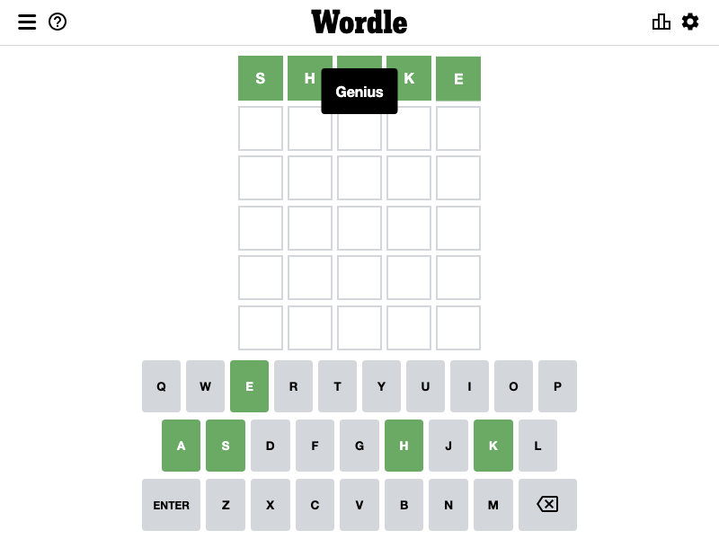

# Wordle Solver with Deno

A wordle solver with Deno.



# How to use
Example codes are available in `/examples`!
## Basic usage

```ts
// example.ts

import { solve } from "./wordle.ts"

console.log("Let's solve Wordle!")

const answer = await solve()

console.log(`The answer is "${answer}"!`)

```

Run `example.ts` as follows
```bash
deno run --allow-net --unstable --allow-env --allow-read --allow-write --allow-run --unstable example.ts
```
or
```bash
deno run -A --unstable example.ts
```

The result is
```
Let's solve Wordle!
The answer is "shake"!
```

# How it works
Wordle saves the game status in localStorage.
The value of nyt-wordle-statistics in it is as follows.

```
{"boardState":["hello","shake","","","",""],"evaluations":[["present","present","absent","absent","absent"],["correct","correct","correct","correct","correct"],null,null,null,null],"rowIndex":2,"solution":"shake","gameStatus":"WIN","lastPlayedTs":1645053407046,"lastCompletedTs":1645053407046,"restoringFromLocalStorage":null,"hardMode":false}
```

Yes, there is an answer in this.
This wordle solver gets `solution` parameter from this by using puppeteer.